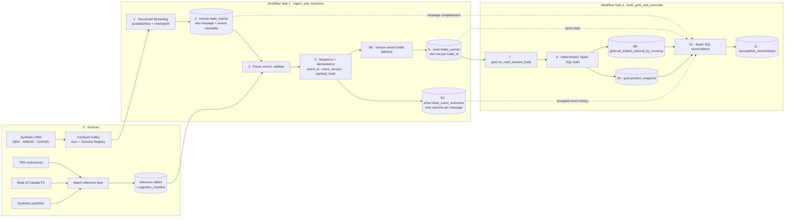

# MapleTrade Streaming Lakehouse

MapleTrade is a Databricks lakehouse portfolio project that processes synthetic
`NEW`, `AMEND`, and `CANCEL` trade-booking events from Confluent Kafka. PySpark Structured
Streaming, Spark SQL, and Delta Lake create traceable event outcomes, authoritative current
trade state, portfolio positions, and CAD-denominated traded-notional products.

> **Execution status:** local generation, public FX acquisition, and unit tests are verified.
> The Confluent-to-Databricks run requires the account configuration described in the runbook
> and must not be claimed as executed until that run succeeds.

## Why this project exists

The project demonstrates more than a happy-path medallion pipeline. It deliberately generates
duplicate, invalid, late, and conflicting events and proves that:

- every ingested message receives exactly one processing outcome;
- a late event cannot overwrite a newer trade version;
- retries do not create duplicate Silver records;
- `CANCEL` produces `CANCELLED` current state and contributes nothing to Gold positions; and
- independently recomputed Silver and Gold results reconcile.

## Architecture

The numbers show execution order. Every table and view shown below is governed in the
`mapletrade_dev` Unity Catalog catalog.



See [architecture.md](docs/architecture.md) for the processing rules and failure-recovery design.

## Processing outcomes

`silver.trade_event_outcomes` replaces separate physical quarantine, duplicate, and stale tables.
Convenience views expose each category.

| Outcome | Meaning |
|---|---|
| `APPLIED` | Valid lifecycle event accepted into authoritative history |
| `DUPLICATE` | Repeated `event_id` or equivalent replay of the same trade version |
| `QUARANTINED` | Payload, reference, business, or lifecycle validation failed |
| `STALE_VERSION` | A lower version arrived after a newer accepted version |
| `VERSION_CONFLICT` | The same trade/version carried different business content |

## Data sources

- Trade transactions are deterministic synthetic data; no customer or institutional trades are used.
- Instrument names and symbols are curated from the [TMX Listed Company Directory](https://www.tsx.com/en/listings/listing-with-us/listed-company-directory).
- Daily currency-to-CAD rates come from the [Bank of Canada Valet API](https://www.bankofcanada.ca/valet-api-how-to/).
- Portfolio records and instrument enrichment fields are explicitly identified as synthetic.

The committed sample uses 20 instruments, five fictional portfolios, and Bank of Canada rates for
2026-08-11. The default generator creates 10,000 base trades and approximately 11,000–12,000
lifecycle messages after amendments, cancellations, and failure injection.

## Repository structure

```text
mapletrade-streaming-lakehouse/
├── producer/                 # Local generator wrapper and Confluent producer
├── schemas/                  # Avro v1 data contract
├── ingestion/                # TMX, Bank of Canada, and portfolio preparation
├── src/mapletrade/           # Pure Python and reusable PySpark/Delta logic
├── databricks/               # Setup, reference load, two Workflow notebooks, job template
├── scripts/                  # One-command local MVP data preparation
├── tests/unit/               # Generator, quality, lifecycle, schema, and acquisition tests
├── tests/spark/              # Spark aggregation tests
├── data/sample/              # Small attributable reference samples
└── docs/                     # Architecture, dictionary, runbook, decisions, performance
```

## Local quick start

Python 3.10 or later is required. Java is required only for local Spark tests; Databricks Runtime
provides Spark and Delta Lake for the actual pipeline.

```powershell
python -m venv .venv
.\.venv\Scripts\Activate.ps1
python -m pip install -e ".[producer,dev]"

# Uses the committed FX sample and produces a ready-to-upload bundle.
python scripts/prepare_mvp_data.py --num-trades 10000 --use-sample-fx

pytest -q
```

To retrieve current public FX data instead of the committed sample:

```powershell
python scripts/prepare_mvp_data.py --num-trades 10000 --event-date 2026-08-11
```

Generated files are written to:

```text
data/upload/reference/   # instruments.csv, portfolios.csv, fx_rates.csv
data/upload/replay/      # trade_events.jsonl and generation metadata
```

## Publish to Confluent Kafka

1. Create topic `mapletrade.trade-events.v1` with three partitions.
2. Create Kafka and Schema Registry API keys.
3. Copy `.env.example` to `.env` and set the values locally.
4. Export those values into the shell; `.env` is intentionally not loaded implicitly.
5. Run:

```powershell
python producer/kafka_producer.py `
  --events data/generated/mvp/trade_events.jsonl `
  --schema schemas/trade_event_v1.avsc
```

The Avro serializer registers the value schema and publishes with `trade_id` as the Kafka key.
Producer idempotence and `acks=all` are enabled, while downstream event idempotency is enforced
independently in Silver.

## Run on Databricks

The detailed checklist is in [runbook.md](docs/runbook.md). In summary:

1. Add this repository to a Databricks Git folder.
2. Run `databricks/00_setup_unity_catalog.py`.
3. Upload the three reference CSVs to
   `/Volumes/mapletrade_dev/reference/raw_files/`.
4. Run `databricks/01_load_reference_data.py`.
5. Add Confluent credentials to the `mapletrade` Databricks secret scope.
6. Replace placeholders in `databricks/workflow.template.json`, create the Workflow, and run it.

If outbound Confluent connectivity is unavailable, upload `trade_events.jsonl` into
`/Volumes/mapletrade_dev/ops/pipeline_state/replay/` and set `source_mode=replay`. The README and
portfolio evidence must state which mode was actually executed.

## Verification queries

```sql
SELECT outcome, count(*)
FROM mapletrade_dev.silver.trade_event_outcomes
GROUP BY outcome
ORDER BY outcome;

SELECT trade_status, count(*)
FROM mapletrade_dev.silver.trade_current
GROUP BY trade_status;

SELECT *
FROM mapletrade_dev.ops.pipeline_reconciliation
ORDER BY checked_at DESC, check_name;
```

A successful Workflow run must have no failed reconciliation checks.

## Tests and current evidence

Verified locally on 2026-08-19:

- 12 unit/integration tests passed;
- one Spark test was skipped because the local machine has no Java/PySpark runtime;
- the Bank of Canada API request and normalization completed successfully; and
- 10,000 base trades produced 11,676 deterministic messages with seed `2026`.

Spark/Delta behavior, restart recovery, and the final Kafka or replay execution remain Databricks
acceptance steps. Do not convert planned or local-only results into résumé claims.
Use the [portfolio evidence checklist](docs/evidence_checklist.md) during the cloud run.

## Deliberate MVP boundaries

The MVP excludes Delta Change Data Feed, Terraform, Lakeflow Declarative Pipelines, SCD Type 2,
dashboards, multiple environments, and production alerting. Gold is rebuilt deterministically from
the authoritative Silver current-state table because the demonstrated volume is small and the full
rebuild is easy to verify.

The design remains CDF-ready: Silver Current is the only source of truth, Gold has stable business
keys, and the aggregation functions are reusable. CDF is a future optimization, not a prerequisite
for correctness.

See [roadmap.md](roadmap.md) for extensions and [performance.md](docs/performance.md) for the optional
Spark experiment.
